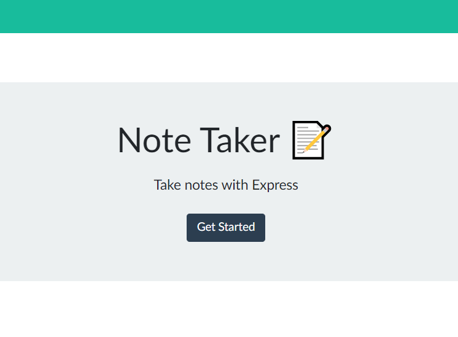
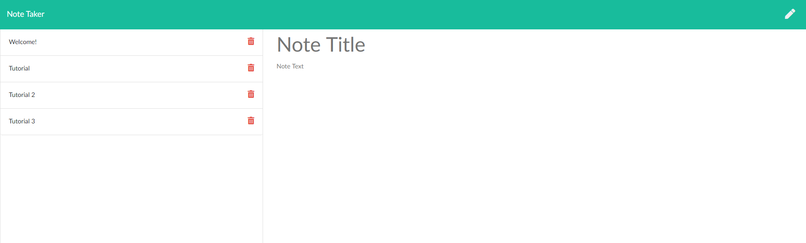

# Note Taker
## Description
A Heroku based application demonstrating 3 types of API calls: GET, POST, and DELETE.
## Table of Contents
* [Description](#Description)
* [Installation](#Installation)
* [Usage](#Usage)
* [License](#License)
* [Examples](#Examples)
* [Deployed Site](#Deployed)
* [Questions](#Questions)

## Installation
None, simply visit the webpage displayed at the bottom of this document.
## Usage
Tutorials are displayed in the application itself in the form of notes.
### License
MIT
#### Examples

#### Deployed Site
https://hidden-atoll-55979.herokuapp.com/
#### Questions?
If you have questions regarding this program: 
Send me a message through GitHub:  
Or through email here: 
